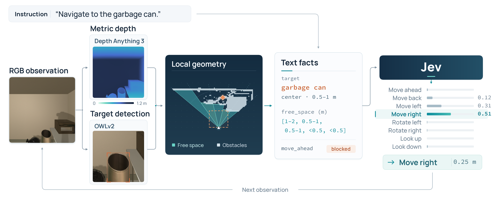

# DepthJev: Turning Depth into Text for Embodied Navigation

   

<p align="center">
  <b>English</b> | <a href="README_zh.md">简体中文</a>
</p>

🧭 **DepthJev** is a navigation agent for EmbodiedBench EB-Navigation. It bridges the gap between raw visual input and text-based reasoning by converting RGB frames into metric depth via **Depth Anything 3**, detecting targets via **OWLv2**, and translating geometric constraints into short text facts. **Jev** reads these facts to output reliable navigation actions.

## ✨ Highlights

- 📈 **Competitive performance.** DepthJev succeeds in 46.7% of all 300 EB-Navigation episodes.
- 📏 **Metric grounding.** Jev reasons over distances in metres, not pixels. Free space in five sectors, the collision check for the next 0.25 m step and the target distance all come from monocular metric depth.
- ⚡ **Fast.** A step takes 0.76 s on one H100. DA3 needs 0.15 s, OWLv2 0.22 s and Jev 0.34 s.


## 🏗️ How it works



1. **Perceive.** Depth Anything 3 estimates metric depth; OWLv2 detects the target.
2. **Describe.** Geometry and action history become text facts about free space, target distance and movement constraints.
3. **Act.** Jev reads these facts, selects one of eight navigation actions, and repeats with the next observation.


## 🚀 Getting Started

**1. Clone dependencies**

```bash
git clone https://github.com/EmbodiedBench/EmbodiedBench.git repos/EmbodiedBench
git clone https://github.com/ByteDance-Seed/Depth-Anything-3.git repos/Depth-Anything-3
```

**2. Server environment**

```bash
conda create -y -p envs/depthjev python=3.11 pip
conda activate ./envs/depthjev
pip install -r requirements.txt
hf download depth-anything/DA3METRIC-LARGE --local-dir checkpoints/DA3METRIC-LARGE
hf download google/owlv2-base-patch16-ensemble --local-dir checkpoints/owlv2-base-patch16-ensemble
```

**3. Evaluation environment**

```bash
conda create -y -p envs/depthjev-eval python=3.9.21 pip
conda activate ./envs/depthjev-eval
pip install -r requirements-eval.txt
```

**4. Headless rendering for AI2-THOR**

```bash
sudo apt-get install -y --no-install-recommends xvfb x11-utils libgl1-mesa-dri libgl1-mesa-glx \
    libglu1-mesa libxcursor1 libxrandr2 libxinerama1 libxi6 libxxf86vm1
```

**5. Jev API key**

```bash
cp .env.example .env    # then fill in TYPESAFE_API_KEY
```

**6. Run**

```bash
bash scripts/run.sh                                       # smoke test, 3 base episodes
bash scripts/run.sh full --sets all --ratio 1             # all 300 episodes, about 2.2 h
bash scripts/run.sh full --sets all --ratio 1 --parallel  # one server per subset, add --gpus 0 to share one card
```


| Option       | Default      | Description                                          |
| ------------ | ------------ | ---------------------------------------------------- |
| `RUN_NAME`   | `smoke`      | name of the run                                      |
| `--sets`     | `base`       | comma-separated subsets, or `all`                    |
| `--ratio`    | `0.05`       | EmbodiedBench `down_sample_ratio`, 1 runs every task |
| `--gpus`     | visible GPUs | CUDA devices for the servers                         |
| `--parallel` | off          | one server + evaluator per subset                    |


Server and evaluator in separate terminals

```bash
DEPTHJEV_RUN_NAME=dev bash scripts/server.sh
SERVER_URL=http://127.0.0.1:23333/process bash scripts/eval.sh exp_name=dev eval_sets=[base] down_sample_ratio=0.05
```

The server listens on `127.0.0.1` by default. For an evaluator on another machine, start it with `bash scripts/server.sh --host 0.0.0.0` and set `SERVER_URL` to the server's address.


## ⚙️ Configuration

Settings are defined in [config.json](config.json).


| Key                           | Default                               |
| ----------------------------- | ------------------------------------- |
| `server_env`, `eval_env`      | `envs/depthjev`, `envs/depthjev-eval` |
| `da3_dir`, `owlv2_dir`        | `checkpoints/...`                     |
| `jev_model`, `jev_timeout`    | `jev-latest`, `20`                    |
| `port`, `detection_threshold` | `23333`, `0.1`                        |


## 📊 Results

Evaluation on all **300 EB-Navigation episodes** with one **H100**. Run with `bash scripts/run.sh full --sets all --ratio 1`.

**Navigation performance**


| Subset              | Successes   | Success rate | Steps / episode | Target type correct |
| ------------------- | ----------- | ------------ | --------------- | ------------------- |
| base                | 32/60       | 0.533        | 15.2            | 60/60               |
| common_sense        | 31/60       | 0.517        | 15.4            | 58/60               |
| complex_instruction | 30/60       | 0.500        | 15.3            | 60/60               |
| visual_appearance   | 22/60       | 0.367        | 16.9            | 25/60               |
| long_horizon        | 25/60       | 0.417        | 17.3            | 60/60               |
| **All**             | **140/300** | **0.467**    | 16.0            | 263/300             |


**Server latency**

Mean, p50 and p90 are for one run; the last column shows three runs sharing one GPU. All values are in seconds.


| Stage                               | Mean     | p50      | p90      | Mean, 3 runs/GPU |
| ----------------------------------- | -------- | -------- | -------- | ---------------- |
| DA3 depth                           | 0.15     | 0.13     | 0.23     | 0.27             |
| OWLv2 detection                     | 0.22     | 0.21     | 0.22     | 0.32             |
| Jev decision                        | 0.34     | 0.27     | 0.51     | 0.38             |
| Target resolution, once per episode | 0.82     | 0.61     | 1.63     | 1.42             |
| **Whole step**                      | **0.76** | **0.64** | **1.04** | **1.06**         |


With AI2-THOR software rendering, a single run averages about 21 s per episode.


### Examples and failure analysis

Successful episode: reaching a pot in 9 steps

In a `common_sense` task, "I need a vessel to boil pasta for dinner" resolves to **Pot**. Selected steps:

```text
s0 vis=T center d=2.70 fwd=clear -> move_ahead p=1.00
s4 vis=T center d=1.72 fwd=clear -> move_ahead p=1.00
s5 vis=T left   d=1.47 fwd=clear -> move_ahead p=0.91
s7 vis=T left   d=0.89 fwd=clear -> move_left  p=0.67
s8 vis=T center d=0.84 fwd=clear -> move_ahead p=1.00   (success)
```


Text facts: what Jev reads before choosing an action

Selected fields from step 0 of `base` task 21, target **GarbageCan**:

```json
{
  "task": {"target_object": "garbage can", "step": 1, "steps_left": 20},
  "target": {"visible": true, "sector": "right", "distance": "1 to 2 m"},
  "free_distance_ahead_by_sector": {
    "far_left": "1 to 2 m",
    "left": "1 to 2 m",
    "center": "over 2 m",
    "right": "0.5 to 1 m",
    "far_right": "0.5 to 1 m"
  },
  "move_check": {
    "move_ahead": "clear",
    "move_back": "unknown",
    "move_left": "unknown",
    "move_right": "unknown"
  },
  "move_ahead_check_saw_the_floor": false,
  "camera_pitch": "level",
  "recent_actions": []
}
```

**Decision:** `move_ahead` · probability 0.95 · 1,513 input tokens · 0.22 s.


Failure analysis: 160 unsuccessful episodes


| Pattern                                           | Episodes |
| ------------------------------------------------- | -------- |
| Target rarely detected or incorrectly identified  | 51       |
| Sidestepping left and right without progress      | 40       |
| Stuck against obstacles                           | 32       |
| Distance underestimated or false target detection | 27       |
| Other                                             | 10       |


- **Detection.** The first group includes 17 `visual_appearance` episodes with an incorrect target type. Adding "trash can" and "bin" improved GarbageCan success from 0/5 to 5/5 on a development sample; low-score detections (0.1–0.2) remain a common source of errors.
- **Action constraints.** Attaching constraints directly to action options prevented repeated `look_down` actions more effectively than a general rule.
- **Scene difficulty.** Across the same 60 scenes and targets, 12 succeeded under all five instruction variants and 22 failed under all five. `long_horizon` also changes the starting orientation by 180°.


## 📁 Project Structure

```
depthjev/
├── server.py         # Flask /process + /health, one JSONL line per request
├── policy.py         # one step: parse → depth → detect → facts → Jev → EmbodiedBench JSON
├── prompt_parse.py   # instruction and action history from the EmbodiedBench prompt
├── depth.py          # DA3METRIC-LARGE → metric depth
├── detect.py         # OWLv2 target detection
├── geometry.py       # back-projection, floor estimate, sector distances, step collision
├── facts.py          # the state Jev reads, move checks, search status
├── jev_client.py     # the three Jev Choices, rules, iTHOR types, detector aliases
├── actions.py        # the eight EB-Navigation actions
├── config.py         # config.json → shell variables
├── eb_launch.py      # starts EmbodiedBench in the evaluation environment
└── report.py         # latency, success and per-episode tables
scripts/
├── run.sh            # end-to-end evaluation, single or --parallel
├── server.sh         # server only
└── eval.sh           # evaluator only
```


## 🙏 Acknowledgements

- [EmbodiedBench](https://github.com/EmbodiedBench/EmbodiedBench) for EB-Navigation
- [Depth Anything 3](https://github.com/ByteDance-Seed/Depth-Anything-3) for metric depth
- [OWLv2](https://huggingface.co/google/owlv2-base-patch16-ensemble) for open-vocabulary detection
- [TypeSafe Jev](https://docs.typesafe.ai) for the decision model
- [AI2-THOR](https://ai2thor.allenai.org) for the simulator and its object types
